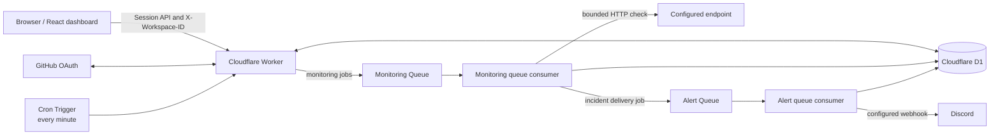

<div align="center">

## **<ins>LIVE DEPLOYMENT</ins>**

### **[https://endpoint-sentinel.endpoint-sentinel.workers.dev](https://endpoint-sentinel.endpoint-sentinel.workers.dev/)**

</div>

---

### **<ins>JURY ACCESS NOTICE</ins>**

> **GitHub authentication has been temporarily disabled for the Geeks2Code hackathon evaluation so that you jurors can access and test the deployed application without signing in.**
>
> **Authentication remains fully implemented in the production configuration. After evaluation, it can be restored by setting the `PUBLIC_JURY_DEMO` flag to `false` and redeploying the application.**

---

### **<ins>CLOUDFLARE INFRASTRUCTURE VERIFICATION</ins>**

> **Endpoint Sentinel is deployed using Cloudflare Workers, D1, Queues and Cron Triggers. Because the Cloudflare management dashboard is private and requires account credentials, those credentials cannot be shared publicly. The screenshot below is provided as verification of the deployed Cloudflare infrastructure.**


---

### **<ins>CURRENT DEVELOPMENT WORK</ins>**

> **Cloudflare Workers cannot directly access APIs running on `localhost` or inside a private network. To solve this properly, we are designing an Endpoint Sentinel Local Agent that will run inside the developer’s machine or private network, execute checks locally and securely submit the results to Endpoint Sentinel.**
>
> **We are also working on automated setup and Docker packaging to simplify installation, local development and self-deployment for small engineering teams. These capabilities were outside the available hackathon development window :( and are therefore documented as the next implementation milestone rather than being represented as completed features in this submission :).**
>
> **<ins>DEMO VIDEO NOTICE</ins>
The demo video has been slightly accelerated to meet the submission duration limit, as the original demonstration was over seven minutes long. We sincerely apologize for any inconvenience and appreciate your understanding. :(**

---

# Endpoint Sentinel

Self-deployable API monitoring and incident management for small engineering teams, built on Cloudflare Workers, D1, Queues, and Cron Triggers.

Endpoint Sentinel schedules HTTP checks, stores result history, opens and recovers incidents, sends Discord webhook alerts, and provides a workspace-scoped React dashboard with GitHub authentication.

## Table of contents

- [What it solves](#what-it-solves)
- [Key features](#key-features)
- [Architecture](#architecture)
- [How monitoring works](#how-monitoring-works)
- [Technology stack](#technology-stack)
- [Security and tenant isolation](#security-and-tenant-isolation)
- [Prerequisites](#prerequisites)
- [Local development](#local-development)
- [Deploy to Cloudflare](#deploy-to-cloudflare)
- [Configure GitHub OAuth](#configure-github-oauth)
- [Configure Discord alerts](#configure-discord-alerts)
- [Workspaces and invitations](#workspaces-and-invitations)
- [Configuration reference](#configuration-reference)
- [Database migrations](#database-migrations)
- [API route groups](#api-route-groups)
- [Testing and verification](#testing-and-verification)
- [Operational demo](#operational-demo)
- [Troubleshooting](#troubleshooting)
- [Limitations](#limitations)
- [Contributing](#contributing)
- [License](#license)

## What it solves

Small teams often need more than a periodic uptime ping but less than a large observability platform. Endpoint Sentinel combines scheduled endpoint checks, result history, incident state, alert delivery evidence, and team access in one isolated Cloudflare deployment.

It is designed to answer three operational questions quickly:

1. Which endpoints are healthy, slow, or failing?
2. Is a failure transient, acknowledged, recovered, or manually resolved?
3. Was the corresponding alert delivered?

## Key features

- Create, edit, pause, resume, check, and delete HTTP or HTTPS monitors.
- Configure method, expected status, timeout, latency threshold, and check interval.
- Queue scheduled and manual checks; retain result history in D1.
- Classify results as **Healthy**, **Degraded**, or **Critical**.
- Open incidents after consecutive unhealthy results and recover them after consecutive healthy results.
- Acknowledge or manually resolve incidents while retaining an event timeline.
- Record queued, delivered, failed, or skipped webhook deliveries and retry counts.
- Send incident, severity-change, recovery, and manual-resolution notifications to Discord.
- Authenticate with GitHub OAuth and opaque server-side sessions.
- Isolate endpoints, jobs, results, incidents, and members by workspace.
- Manage `OWNER` and `MEMBER` roles with final-owner protection.
- Create expiring, revocable invitations targeted to a specific GitHub login.
- Use a desktop-first dashboard with Light and AMOLED Dark themes and persistent theme preference.
- Show safe endpoint links and hostname-only favicons with deterministic fallbacks.

## Architecture



The Worker serves the built React assets and all `/api/*` routes. D1 stores application state. Cron, monitoring-queue, and alert-queue events invoke handlers in the same Worker deployment.

## How monitoring works

1. The one-minute Cron handler identifies enabled endpoints whose configured interval is due.
2. It creates deduplicated jobs and publishes them to `endpoint-sentinel-checks`.
3. The monitoring consumer claims each job and performs a bounded HTTP request. Redirects are handled manually and revalidated.
4. The consumer stores the result and job status in D1; response bodies are not retained.
5. Incident evaluation counts consecutive results. By default, two unhealthy results open an incident and one healthy result recovers it.
6. Incident transitions create deduplicated delivery records and publish messages to `endpoint-sentinel-alerts`.
7. The alert consumer sends Discord notifications when `ALERT_WEBHOOK_URL` is configured and records the outcome in D1.

Both queues are at-least-once. Unique job/result links, scheduled-job keys, transition constraints, and alert deduplication keys make persisted processing idempotent. Cron republishes stale jobs and resumes deferred incident or alert work after temporary infrastructure failures.

### Incident behavior

- A single unhealthy result is transient with the default threshold and does not open an incident.
- Consecutive `DEGRADED` or `CRITICAL` results open one active incident per endpoint.
- Repeated failures update the incident without repeating the same transition alert.
- A change from `DEGRADED` to `CRITICAL` creates a severity-change event and alert.
- Acknowledgement is recorded but does not disable monitoring or automatic recovery.
- Automatic recovery and manual resolution are stored and displayed as distinct events.
- A later threshold-crossing failure can open a new incident after resolution.

## Technology stack

| Layer | Technology |
| --- | --- |
| Dashboard | React 19, TypeScript, CSS design tokens, Vite |
| Runtime and API | Cloudflare Workers |
| Persistence | Cloudflare D1 / SQLite migrations |
| Scheduling | Cloudflare Cron Triggers |
| Background work | Cloudflare Queues |
| Authentication | GitHub OAuth App |
| Alerts | Discord-compatible webhook payloads |
| Tests | Vitest, Cloudflare Workers test pool, Playwright, axe-core |

## Security and tenant isolation

This project includes the following controls:

- Random OAuth state is stored as a SHA-256 hash, expires after ten minutes, and is single-use.
- GitHub authorization codes are exchanged server-side; access tokens are discarded after identity retrieval.
- Sessions use opaque `HttpOnly; Secure; SameSite=Lax` cookies; D1 stores only SHA-256 token hashes.
- Logout revokes the stored session, and expired sessions are rejected and cleaned up.
- OAuth return paths are restricted to local application paths.
- Authenticated state-changing requests require an `Origin` exactly matching `APP_BASE_URL`.
- `X-Workspace-ID` selects only from server-verified memberships.
- Resource queries include workspace identity; only owners can administer members and invitations.
- Atomic checks prevent removal or demotion of the final owner.
- Invitation tokens have 256 bits of randomness; only hashes are stored, and acceptance requires the invited GitHub login.
- Targets must be absolute HTTP/HTTPS URLs without embedded credentials. Literal private, local, loopback, link-local, multicast, and unspecified targets are rejected.
- Redirects are capped and revalidated; timeouts are enforced and response bodies are discarded.
- SQL statements are parameterized.
- API responses use `Cache-Control: no-store`, CSP, frame, MIME-sniffing, referrer, and permissions headers.
- Logging redacts invitation paths, long token-like values, webhook values, and target URLs from errors.
- The webhook URL is a Worker secret and is not stored in D1 or returned through the API.

Application validation cannot replace network-level egress policy. See [Limitations](#limitations) for the DNS-rebinding caveat.

## Prerequisites

- Node.js 24 LTS and npm.
- A Cloudflare account with Workers, D1, Queues, and Cron access.
- Wrangler authentication for the target account.
- A GitHub account that can create an OAuth App.
- Optionally, permission to create a webhook in a private Discord channel.

## Local development

### 1. Install the project

```powershell
git clone https://github.com/YOUR-ACCOUNT/Endpoint-Sentinel.git
Set-Location Endpoint-Sentinel
npm ci
```

### 2. Create local OAuth configuration

Create a separate GitHub OAuth App for local development:

```text
Homepage URL:
http://localhost:5173

Authorization callback URL:
http://localhost:5173/api/auth/github/callback
```

Create `.dev.vars` in the repository root:

```dotenv
GITHUB_CLIENT_ID="your-local-oauth-client-id"
GITHUB_CLIENT_SECRET="your-local-oauth-client-secret"
BOOTSTRAP_OWNER_GITHUB_LOGIN="your-github-login"
APP_BASE_URL="http://localhost:5173"
# Optional:
# ALERT_WEBHOOK_URL="https://discord.com/api/webhooks/..."
```

`.dev.vars` is ignored by Git. Never reuse production credentials or commit this file.

### 3. Prepare the local database and run

```powershell
npx wrangler d1 migrations apply endpoint-sentinel --local
npm run cf-typegen
npm run dev
```

Open `http://localhost:5173`. The Vite Cloudflare plugin runs the frontend and Worker together, so the OAuth callback and API share the same local origin.

To exercise a scheduled event in a separate Wrangler session:

```powershell
npx wrangler dev --test-scheduled
Invoke-WebRequest -Method Get -Uri 'http://localhost:8787/__scheduled?cron=*+*+*+*+*'
```

The checker rejects localhost and private-network targets. Use a controlled public test endpoint for actual monitor requests.

## Deploy to Cloudflare

These steps create an isolated copy. They do not reuse another deployment's database, OAuth credentials, or webhook.

### 1. Clone and authenticate Wrangler

```powershell
git clone https://github.com/YOUR-ACCOUNT/Endpoint-Sentinel.git
Set-Location Endpoint-Sentinel
npm ci
npx wrangler login
npx wrangler whoami
```

### 2. Create D1 and update the binding

```powershell
npx wrangler d1 create endpoint-sentinel
```

Wrangler prints a `database_id`. Replace the existing `database_id` under `[[d1_databases]]` in `wrangler.toml` with the ID created in your account. Keep the `DB` binding, database name, and migrations directory unchanged. Do not copy a database ID from documentation or screenshots.

### 3. Create queues and dead-letter queues

```powershell
npx wrangler queues create endpoint-sentinel-checks
npx wrangler queues create endpoint-sentinel-checks-dlq
npx wrangler queues create endpoint-sentinel-alerts
npx wrangler queues create endpoint-sentinel-alerts-dlq
```

The deploy command registers the producer bindings and consumers declared in `wrangler.toml`.

### 4. Apply migrations

```powershell
npx wrangler d1 migrations list endpoint-sentinel --remote
npx wrangler d1 migrations apply endpoint-sentinel --remote
```

Wrangler applies pending files in filename order. Review the list before confirming. A D1 export can contain monitored URLs, identities, and incident history; keep exports private and never commit them.

### 5. Deploy once to obtain the URL

```powershell
npm run build
npx wrangler deploy
npx wrangler deployments list
```

Record the generated origin, such as `https://YOUR-WORKER.YOUR-SUBDOMAIN.workers.dev`.

### 6. Configure OAuth and secrets

Follow [Configure GitHub OAuth](#configure-github-oauth), then set values interactively:

```powershell
npx wrangler secret put GITHUB_CLIENT_ID
npx wrangler secret put GITHUB_CLIENT_SECRET
npx wrangler secret put BOOTSTRAP_OWNER_GITHUB_LOGIN
npx wrangler secret put APP_BASE_URL
```

For Discord alerts:

```powershell
npx wrangler secret put ALERT_WEBHOOK_URL
```

Wrangler stores these as encrypted Worker secrets. Do not put their values in `wrangler.toml` or Git.

### 7. Redeploy and validate

```powershell
npm run cf-typegen
npm run typecheck
npm test
npm run build
npx wrangler deploy
npx wrangler deployments list
npx wrangler queues list
```

Open the Workers URL, sign in as the bootstrap owner, create a controlled endpoint, run **Check now**, and confirm that history is recorded. For later updates, verify changes, list and apply new migrations, then deploy again.

## Configure GitHub OAuth

Create an OAuth App under your GitHub account or organization using your deployment's exact origin:

```text
Homepage URL:
https://YOUR-WORKER.YOUR-SUBDOMAIN.workers.dev

Authorization callback URL:
https://YOUR-WORKER.YOUR-SUBDOMAIN.workers.dev/api/auth/github/callback
```

`APP_BASE_URL` must be that exact HTTPS origin, with no extra path. `BOOTSTRAP_OWNER_GITHUB_LOGIN` is compared case-insensitively; only that identity is automatically granted `OWNER` access to the migration-created default workspace. A random first visitor cannot claim its data. Other authenticated users without membership can create isolated workspaces and become their owners. Changing the bootstrap value does not transfer existing membership.

Use a separate OAuth App for localhost because a GitHub OAuth App accepts one callback URL.

## Configure Discord alerts

1. In Discord, open a private channel's settings.
2. Choose **Integrations → Webhooks → New Webhook** and copy its URL.
3. Store it with `npx wrangler secret put ALERT_WEBHOOK_URL`.
4. Keep `ALERT_WEBHOOK_FORMAT = "discord"` in `wrangler.toml`.
5. Redeploy after changing configuration.

Discord mode sends incident-opened, severity-change, automatic-recovery, and manual-resolution notifications. Acknowledgement does not create an alert, and repeated failures at the same severity do not duplicate transition alerts.

HTTP 2xx succeeds. HTTP 408, 425, 429, and 5xx responses retry within bounded queue attempts; other 4xx responses fail permanently. Without a webhook secret, monitoring continues and delivery is recorded as `SKIPPED`.

Test with an endpoint you control rather than disrupting a third-party service.

## Workspaces and invitations

- A signed-in user without memberships can create a workspace and becomes its owner.
- Owners use **Team** to view members, change roles, remove members, and manage invitations.
- Invitations target one GitHub login, grant `MEMBER`, and expire after 1, 3, 7, or 14 days.
- The raw token appears only in the created link. Share it privately; Endpoint Sentinel sends no email.
- Acceptance requires the invited GitHub account. Owners can revoke pending invitations.
- Accepted, expired, revoked, malformed, and reused invitations cannot grant new access.
- At least one owner must remain. Promote another member before demoting or removing an owner.

## Configuration reference

### Secrets

| Name | Configure in | Required | Purpose | Safe value format |
| --- | --- | --- | --- | --- |
| `GITHUB_CLIENT_ID` | Wrangler secret / `.dev.vars` | Yes for login | GitHub OAuth client | ID from your OAuth App |
| `GITHUB_CLIENT_SECRET` | Wrangler secret / `.dev.vars` | Yes for login | Server-side OAuth exchange | Secret from your OAuth App |
| `BOOTSTRAP_OWNER_GITHUB_LOGIN` | Wrangler secret / `.dev.vars` | Required to claim default workspace | Initial owner identity | `your-github-login` |
| `APP_BASE_URL` | Wrangler secret / `.dev.vars` | Strongly required | OAuth, CSRF, and invitation origin | `https://YOUR-WORKER.YOUR-SUBDOMAIN.workers.dev` |
| `ALERT_WEBHOOK_URL` | Wrangler secret / `.dev.vars` | Optional | Alert destination | Private HTTPS webhook URL |

No `SESSION_SECRET` is used. OAuth state, session, and invitation values have 256 bits of randomness and are stored only as SHA-256 hashes.

### Bindings and non-secret values

| Name | Location | Current value/shape | Purpose |
| --- | --- | --- | --- |
| `DB` | `wrangler.toml` D1 binding | Your `endpoint-sentinel` database | Application persistence |
| `ASSETS` | `wrangler.toml` assets | Built client assets | React SPA and invitation fallback |
| `MONITORING_QUEUE` | Queue producer | `endpoint-sentinel-checks` | Scheduled and manual checks |
| `ALERT_QUEUE` | Queue producer | `endpoint-sentinel-alerts` | Webhook delivery jobs |
| `MAX_JOBS_PER_SCHEDULE` | `wrangler.toml` vars | `100` | Per-Cron scheduling limit; code caps at 500 |
| `INCIDENT_FAILURE_THRESHOLD` | `wrangler.toml` vars | `2` | Unhealthy results required to open an incident |
| `INCIDENT_RECOVERY_THRESHOLD` | `wrangler.toml` vars | `1` | Healthy results required for recovery |
| `ALERT_WEBHOOK_FORMAT` | `wrangler.toml` vars | `discord` | Webhook payload format; `generic` is also supported |
| Cron | `wrangler.toml` triggers | `* * * * *` | Scheduling and recovery every minute |
| Observability | `wrangler.toml` | enabled | Workers observability |

## Database migrations

Migrations live in [`migrations/`](migrations/) and must remain ordered:

1. `0001_initial.sql` — workspaces, endpoints, and results.
2. `0002_queue_monitoring.sql` — monitoring jobs and result linkage.
3. `0003_incidents_alerts.sql` — incidents, events, deliveries, and indexes.
4. `0004_auth_workspaces.sql` — users, memberships, sessions, and OAuth state.
5. `0005_team_invitations.sql` — invitations and workspace audit events.

```powershell
# Local
npx wrangler d1 migrations apply endpoint-sentinel --local

# Remote: review, then apply
npx wrangler d1 migrations list endpoint-sentinel --remote
npx wrangler d1 migrations apply endpoint-sentinel --remote
```

Do not edit or reorder an applied migration. Add a new numbered migration for schema changes.

## API route groups

Except for OAuth entry/callback and demo targets, routes require a session. Workspace routes also require a server-verified membership; the browser sends its selection through `X-Workspace-ID`.

| Group | Main routes | Purpose |
| --- | --- | --- |
| Authentication | `/api/auth/github`, `/api/auth/github/callback`, `/api/auth/session`, `/api/auth/logout` | OAuth, session, logout |
| Workspaces | `/api/workspaces` | List or create workspaces |
| Members | `/api/workspaces/:id/members`, `/api/workspaces/:id/members/:userId` | Owner-only administration |
| Invitations | `/api/workspaces/:id/invitations`, `/api/invitations/:token`, `/api/invitations/:token/accept` | Invitation lifecycle |
| Endpoints | `/api/endpoints`, `/api/endpoints/:id` | Endpoint CRUD |
| Jobs/results | `/api/endpoints/:id/check`, `/api/jobs/:id`, `/api/endpoints/:id/results` | Queue, poll, and history |
| Incidents | `/api/incidents`, `/api/incidents/:id`, `/api/incidents/:id/acknowledge`, `/api/incidents/:id/resolve` | Incident lifecycle |
| Incident evidence | `/api/incidents/:id/events`, `/api/incidents/:id/alerts` | Timeline and delivery records |
| Demo targets | `/api/demo/healthy`, `/api/demo/slow`, `/api/demo/failing` | Controlled deployed responses |

## Testing and verification

```powershell
npm run cf-typegen
npm run typecheck
npm test
npm run build
npm audit --omit=dev
git diff --check
```

The repository includes Worker integration tests for monitoring, authentication, tenant isolation, incidents, and teams; presentation unit tests; and localhost-only Playwright fixtures.

For browser QA, run `npm run dev` in one terminal, then:

```powershell
npm run test:browser
npm run test:visual
```

Browser fixtures reject non-localhost targets and do not enter the production bundle.

## Operational demo

1. Sign in to a deployed instance as the bootstrap owner.
2. Monitor the deployed origin plus `/api/demo/healthy`; expect HTTP 200.
3. Run **Check now** and inspect **History**.
4. Monitor `/api/demo/slow` with a threshold below 1,200 ms to demonstrate `DEGRADED`.
5. Monitor `/api/demo/failing` while expecting HTTP 200 to demonstrate `CRITICAL`.
6. Run enough failures to meet the incident threshold; inspect its timeline and Discord delivery.
7. Restore a healthy target to demonstrate automatic recovery.

Do not use someone else's deployment or external service for destructive testing.

## Troubleshooting

### `GitHub authentication is not configured`

Set `GITHUB_CLIENT_ID` and `GITHUB_CLIENT_SECRET` in `.dev.vars` or through Wrangler, then restart or redeploy.

### GitHub callback URL mismatch

The callback must exactly match `${APP_BASE_URL}/api/auth/github/callback`, including scheme, host, port, and path. Use a separate OAuth App for localhost.

### `APP_BASE_URL` or Origin errors

Set it to the exact serving origin without a path. Production must use HTTPS; localhost may use HTTP. A different hostname or port fails mutation-origin validation.

### Local OAuth returns to the wrong deployment

Check `.dev.vars`, restart `npm run dev`, and confirm the callback is `http://localhost:5173/api/auth/github/callback`. Production secrets do not populate local development.

### `401 Authentication is required`

Sign in again. The session may be absent, expired, or revoked. Ensure cookies are enabled and UI and API use one origin.

### `403` workspace/member error

Select a workspace where the user is a member. Only owners can manage Team data; `X-Workspace-ID` cannot grant membership.

### Invitation opens as JSON, 401, or a missing page

Open `/invite/<token>`, not `/api/invitations/<token>`. Keep SPA fallback and `/api/*` Worker-first handling in `wrangler.toml`, then rebuild and deploy.

### Invitation is expired, revoked, accepted, or mismatched

Ask an owner for a new invitation to the exact GitHub login and sign into that account. Never post invitation links publicly.

### D1 table is missing or binding is wrong

Confirm `DB` points to your database ID. List remote migrations and apply only pending files.

### Queue or binding deployment errors

Run `npx wrangler queues list`, confirm all four queues exist, and keep names aligned with `wrangler.toml`.

### Discord alert did not arrive

Confirm the secret and `discord` format. Inspect the incident delivery view for `SKIPPED`, `FAILED`, HTTP status, and attempts. One failure does not open an incident at the default threshold.

### Deployment succeeds but an old UI appears

Confirm the latest deployment, then hard-refresh or use a private window. Do not recreate D1 to fix asset caching.

### `npm audit` service is unavailable

Retry `npm audit --omit=dev` later. Do not use `npm audit fix --force` without reviewing breaking changes.

### LF/CRLF warnings on Windows

These are conversion notices, not test failures. Use `git diff --check` for actual whitespace errors; do not rewrite unrelated files just to silence warnings.

## Limitations

- Authentication is GitHub-only.
- Invitations are shared manually; there is no email delivery.
- Invitations grant `MEMBER`; promotion is a separate owner action.
- There is no dedicated ownership-transfer flow beyond promoting another owner first.
- There is no audit-log UI, although selected team actions are stored.
- One deployment-wide webhook is supported, not per-workspace alert channels.
- Incident thresholds are Worker-wide rather than per endpoint.
- Checks do not support custom headers, credentials, or request bodies.
- There is no public status page or retention-control UI.
- The dashboard is desktop-first; mobile-specific QA is not claimed.
- Favicons depend on an external hostname-only service and may fall back to initials.
- The checker does not pin DNS resolution. Use network-level egress controls to further reduce DNS-rebinding risk.
- Local OAuth requires separate setup.
- Development dependencies can have advisories independent of the production audit; review full output before changing Cloudflare tooling.

## Contributing

1. Create a focused branch.
2. Put schema changes in new numbered migrations.
3. Add or update tests for behavior changes.
4. Run the complete verification block.
5. Never commit `.dev.vars`, D1 exports, Wrangler state, private screenshots, or secret values.
6. Open a pull request describing behavior, migration impact, and verification.

## License

Endpoint Sentinel is available under the [MIT License](LICENSE).
