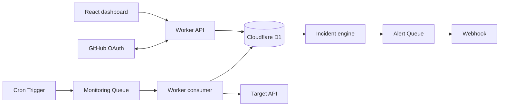
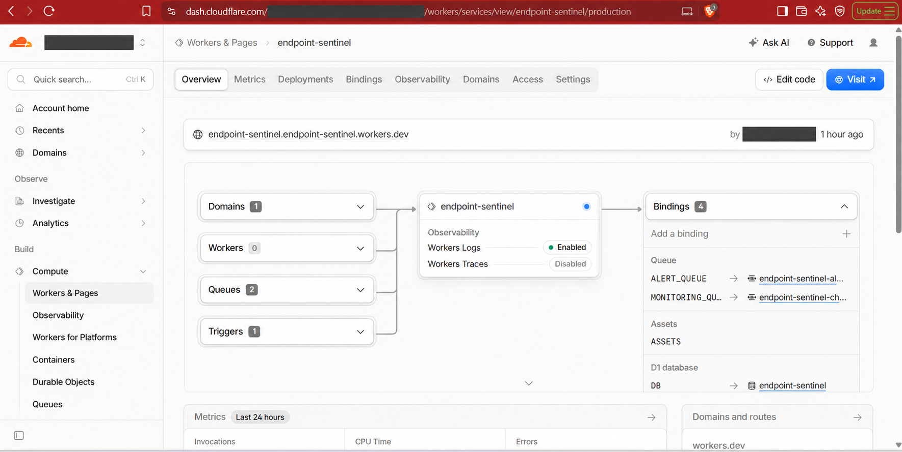

**[LIVE DEPLOYMENT: [https://endpoint-sentinel.endpoint-sentinel.workers.dev/](https://endpoint-sentinel.endpoint-sentinel.workers.dev/)]**

**[JURY ACCESS NOTICE: GitHub authentication is temporarily bypassed only for hackathon evaluation. The deployed application opens directly without login; GitHub OAuth and session enforcement remain implemented for normal operation. To restore normal authentication, disable `PUBLIC_JURY_DEMO` and redeploy.]**

## Demo Video

**[Watch the Endpoint Sentinel demonstration](https://drive.google.com/file/d/1wGP99SxHZ3VNEeGuBpwdf1UYNgQZEfJ6/view?usp=sharing)**

> **Demo video notice:** The video has been slightly accelerated to meet the submission duration limit because the original demonstration exceeded seven minutes. We appreciate your understanding.

# Endpoint Sentinel

Endpoint Sentinel is a serverless API reliability platform that schedules endpoint checks, distributes them through queues, stores performance history, and creates incidents when API health changes.

**Demo workspace notice:** For this public demonstration, we have provided a shared set of general API endpoints so jurors can evaluate the platform immediately. In normal use, each team signs in with GitHub and sees only the endpoints added to its own workspace.

## Problem statement

Small teams often depend on several internal and third-party APIs, yet slow or failed endpoints may be discovered only after users are affected. A traditional single-server monitor also needs continuous hosting and combines scheduling, checking, and API traffic in one process that the team must operate.

## Proposed solution

Endpoint Sentinel lets a team register endpoints and monitoring rules in a web dashboard. A Cloudflare Cron Trigger finds due monitors, publishes each check as an independent queue job, and lets Worker consumers perform real HTTP requests. Results and history are persisted in D1. Repeated unhealthy results create incidents, while incident state changes produce deduplicated webhook alerts.

## Key features

- Endpoint creation, editing, deletion, pause, and resume
- Real HTTP checks with configurable method, expected status, timeout, latency threshold, and interval
- **Healthy**, **Degraded**, and **Critical** classification
- Manual **Check now** actions and scheduled checks
- Isolated processing through Cloudflare Queues with D1-backed job and result history
- Incident opening, severity changes, acknowledgement, manual resolution, and automatic recovery
- Deduplicated Discord-compatible webhook alerts with queued, delivered, failed, or skipped delivery evidence
- GitHub OAuth, opaque server-side sessions, and workspace isolation in normal mode
- `OWNER` and `MEMBER` roles, final-owner protection, and expiring, revocable invitations
- Desktop-first React dashboard with persistent Light and AMOLED Dark themes
- Safe endpoint links and hostname-only favicons with deterministic fallbacks

## How it works

1. Cron runs every minute and identifies enabled endpoints whose intervals are due.
2. Each due or manual check becomes a queue job with a unique deduplication key.
3. A Worker consumer validates the target, follows bounded and revalidated redirects, enforces the timeout, and performs the request.
4. D1 stores the job and one result per job without retaining response bodies.
5. Configured failure and recovery thresholds drive incident transitions.
6. Alert jobs are published only for relevant transitions; delivery outcomes are persisted for investigation.

Queue delivery is at-least-once. Unique job/result relationships, transition constraints, and alert deduplication keys make result persistence effectively once even when a message is delivered again. Cron can republish stale jobs and resume deferred incident or alert work after temporary infrastructure failures.

## Architecture

The dashboard, API, scheduler, monitoring consumer, and alert consumer ship as one team-controlled Cloudflare Worker deployment, while queues separate interactive traffic from endpoint execution.

## Technology stack

| Area | Technology |
| --- | --- |
| Frontend | React 19, TypeScript, Vite |
| API and runtime | Cloudflare Workers |
| Persistence | Cloudflare D1 with ordered SQL migrations |
| Background processing | Cloudflare Queues |
| Scheduling | Cloudflare Cron Triggers |
| Authentication | GitHub OAuth |
| Testing | Vitest, Cloudflare Workers test pool, Playwright, axe-core |
| Development and deployment | Wrangler |
| Source control | Git and GitHub |

## Cloudflare Infrastructure Verification

Endpoint Sentinel is deployed using Cloudflare Workers, D1, Queues, and Cron Triggers. The Cloudflare management dashboard is private and requires authorized account access, so login credentials cannot be shared publicly. The screenshot below provides evidence of the deployed infrastructure, while the public deployment allows jurors to evaluate the application directly.

## Live demonstration flow

The public deployment currently opens the dashboard directly in the designated demo workspace; no GitHub login, OAuth callback, or session is required.

1. Add a public HTTP or HTTPS endpoint that you control.
2. Configure its expected status, timeout, latency threshold, and monitoring interval.
3. Select **Check now** and watch the queued job complete.
4. Open **History** to inspect the stored status and latency result.
5. Pause and resume monitoring, then edit the endpoint configuration.
6. Open **Incidents** to inspect active or resolved events and alert delivery evidence.
7. Delete the test endpoint when evaluation is complete.

Scheduled monitoring, queue processing, D1 persistence, and incident evaluation continue unchanged in jury mode. Team administration is intentionally unavailable because it requires an authenticated user identity.

## Innovation and USP

- **Per-check queue isolation:** a slow target does not make the dashboard API perform the monitoring work inline.
- **Event-driven operation:** Cron and queue events replace a permanently running monitoring server.
- **Reliable persistence:** idempotent database constraints reconcile at-least-once delivery with effectively-once stored results.
- **Signal deduplication:** one active incident per endpoint and transition-specific alert keys prevent repeated failure noise.
- **Integrated workflow:** configuration, health, performance history, incident state, and alert evidence share one workspace-scoped system.
- **Self-controlled deployment:** a team owns its Worker, D1 database, queues, OAuth configuration, and alert destination.

A simple single-process Express monitor can combine scheduling, checking, and API handling. Endpoint Sentinel separates those responsibilities so each check can be queued, retried, and recorded independently.

## Implemented status

| Capability | Status |
| --- | --- |
| Endpoint CRUD, configuration, pause/resume | Implemented |
| Manual and scheduled monitoring | Implemented |
| Queue processing and persistent result history | Implemented |
| Incident lifecycle and alert-delivery evidence | Implemented |
| Discord-compatible webhook delivery | Implemented when a deployment secret is configured |
| GitHub OAuth, sessions, workspaces, roles, and invitations | Implemented; login is bypassed only in jury mode |
| Public jury access to the default workspace | Enabled on the current deployment |
| Unit, Worker integration, browser, accessibility, and bundle-secret checks | Included in the repository |

## Current limitations

- Localhost and private-network targets are rejected; monitoring them requires the planned Private Monitoring Agent.
- Incident failure and recovery thresholds are deployment-wide rather than per endpoint.
- Alert delivery currently uses one deployment-level webhook rather than per-workspace destinations.
- Checks do not yet support custom headers, credentials, or request bodies.
- The dashboard is desktop-first; mobile-specific QA is not currently claimed.
- Favicons use an external hostname-only service and may fall back to generated initials.
- Application-level target validation does not pin DNS resolution; network-level egress controls can further reduce DNS-rebinding risk.
- Jury mode intentionally disables authentication and team administration for evaluation.

## Next development milestone

Cloudflare Workers cannot directly access APIs running on localhost or inside a private network. To solve this properly, we are designing an Endpoint Sentinel Local Agent that will run inside the developer’s machine or private network, execute checks locally and securely submit the results to Endpoint Sentinel.

We are also working on automated setup and Docker packaging to simplify installation, local development and self-deployment for small engineering teams. These capabilities were outside the available hackathon development window and are therefore documented as the next implementation milestone rather than being represented as completed features in this submission.

## Team

- Shwetank Sinha
- Chirag Ghosh
- Prashant Thakur
- Yashika

The team collectively designed and implemented the dashboard, Worker API, monitoring pipeline, persistence, incidents, alerts, authentication, and deployment.

## License

Endpoint Sentinel is available under the [MIT License](LICENSE).
